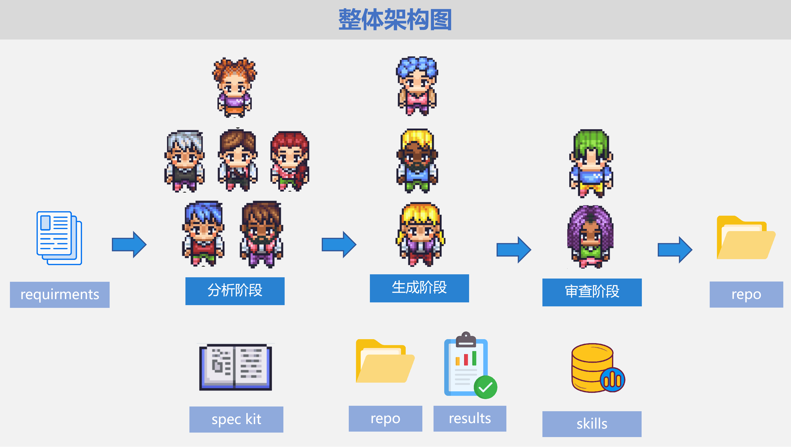
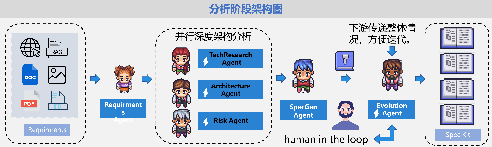
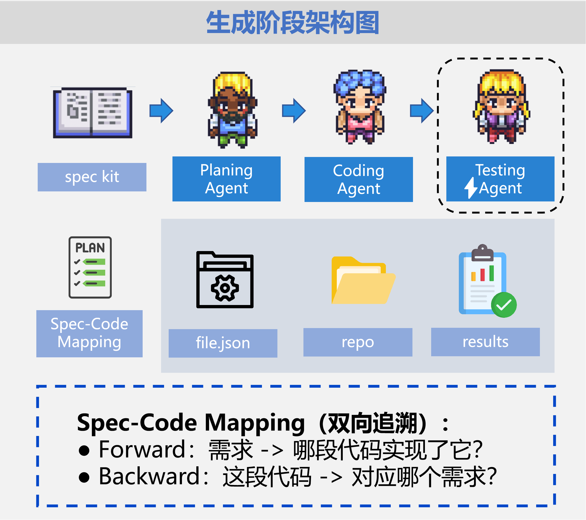
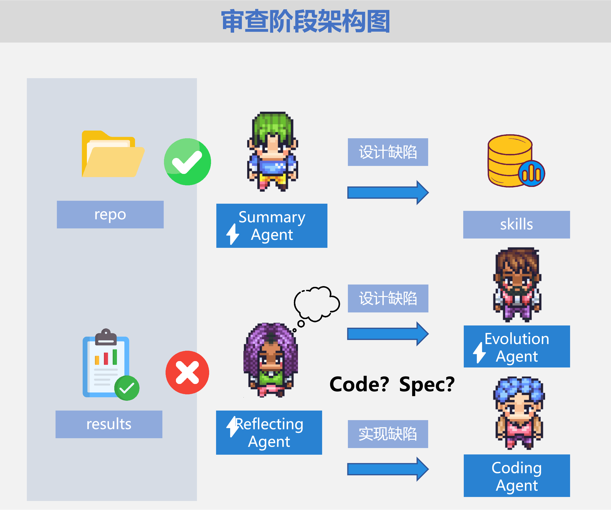

# 🔬 DeepCodeResearch

> 基于 MS-Agent 框架的智能深度代码研究系统，实现从需求到代码的自动化生成。

[](https://opensource.org/licenses/MIT)
[](https://www.python.org/downloads/)
[](https://github.com/modelscope/ms-agent)

---

## 📖 目录

- [项目简介](#-项目简介)
- [✨ 核心特性](#-核心特性)
- [🏗️ 系统架构](#️-系统架构)
- [🚀 快速开始](#-快速开始)
- [📁 项目结构](#-项目结构)
- [🛠️ 技术栈](#️-技术栈)
- [🔧 配置说明](#-配置说明)
- [📚 使用指南](#-使用指南)
- [🤝 贡献指南](#-贡献指南)
- [📄 许可证](#-许可证)
- [🙏 致谢](#-致谢)
- [📚 参考文献](#-参考文献)

---

## 📝 项目简介

DeepCodeResearch 是一个基于 MS-Agent 框架的智能代码生成系统，实现了从需求到代码的自动化生成。系统采用**多 Agent 协作**架构，通过 **11 个专业 Agent** 分工协作，完成从需求分析到代码生成再到测试优化的完整流程。

### 项目背景

随着人工智能技术的飞速发展，代码生成和自动补全已经成为软件开发领域的重要研究方向。本项目旨在通过深度学习技术，实现从需求描述到代码生成的自动化过程，提高软件开发效率，降低人力成本。

### 项目目标

- 🎯 实现从需求描述到代码生成的自动化过程
- 🤖 通过多 Agent 协作提升代码质量和可靠性
- 🔄 支持迭代优化和持续改进
- 📊 提供完整的可追溯性和文档生成

---

## ✨ 核心特性

### 🤖 智能多 Agent 协作
- **11 个专业 Agent**：涵盖需求分析、技术研究、架构设计、风险评估、规范生成、演化分析、计划制定、代码生成、测试编写、反思总结等全流程
- **统一 BaseAgent**：所有 Agent 继承自统一基类，保证代码一致性
- **产物链式协作**：通过 ArtifactStore 实现产物传递和复用

### 🔄 灵活的工作流模式
- **Full 模式**：完整的 11 个 Agent 流程，适合复杂项目
- **Fast 模式**：核心 Agent 流程，提速 20-50%，适合日常开发
- **Minimal 模式**：最小化 Agent 流程，快速原型验证

### 📁 完善的产物管理
- **按会话隔离**：每个会话独立存储，避免混淆
- **按迭代分类**：支持多轮迭代，保存每次演进记录
- **Skills 常驻**：可复用的 Agent Skills 跨会话共享

### 🛠️ 强大的工具链
- **文档处理**：支持 PDF、DOCX、PPTX 等多种格式
- **代码生成**：智能代码生成和文件组织
- **测试驱动**：自动生成单元测试和集成测试
- **Spec-Code 追踪**：实现需求到代码的可追溯性

### 🔌 可扩展架构
- **配置驱动**：通过 YAML 配置文件控制 Agent 行为
- **Mock 系统**：支持快速测试，无需调用真实 LLM
- **插件化设计**：易于添加新的 Agent 和工具

---

## 🏗️ 系统架构

### 整体架构图



### 三阶段工作流

#### 📊 分析阶段



#### 💻 生成阶段



#### 🔍 审查阶段



### 核心组件

| 组件 | 说明 |
|------|------|
| **11 个专业 Agent** | 分工明确，各司其职，通过产物链式协作 |
| **工作流引擎** | 基于 MS-Agent 的 ChainWorkflow，支持迭代执行 |
| **产物管理系统** | ArtifactStore + 文件系统，统一管理所有产物 |
| **路径管理器** | PathManager 统一管理输出路径，支持按会话分类 |
| **配置处理器** | ConfigHandler 统一处理配置生命周期 |
| **工具函数模块** | agent_utils 提供公共逻辑 |
| **Mock 系统** | 支持快速测试，无需真实 LLM |

---

## 🚀 快速开始

### 环境要求

- Python 3.12+
- Conda（推荐）或 virtualenv
- ModelScope API Key

### 安装步骤

#### 1. 创建虚拟环境

```bash
# 使用 Conda（推荐）
conda create -n deep-code python=3.12
conda activate deep-code

# 或使用 venv
python -m venv deep-code
source deep-code/bin/activate  # Linux/Mac
# deep-code\Scripts\activate  # Windows
```

#### 2. 安装依赖

```bash
pip install -r requirements.txt
```

#### 3. 配置环境变量

创建 `.env` 文件：

```bash
# ModelScope API 配置（必需）
MODELSCOPE_API_KEY=your_api_key
MODELSCOPE_BASE_URL=https://api-inference.modelscope.cn/v1

# 输出目录配置（可选，默认 ./output）
OUTPUT_DIR=./output

# 工作流配置（可选，默认 src/config/workflow.yaml）
WORKFLOW_CONFIG=src/config/workflow.yaml

# 工作流模式（可选，默认 full，可选 fast/minimal）
WORKFLOW_MODE=fast

# 是否信任远程代码（可选，默认 true）
TRUST_REMOTE_CODE=true
```

> 💡 **提示**：ModelScope API Key 可在 [ModelScope 控制台](https://modelscope.cn/my/myaccesstoken) 获取

---

## 📝 使用指南

### 方式一：命令行运行

```bash
# 基础用法
python -m src.main "请帮我生成一个贪吃蛇小游戏"

# 指定配置文件
python -m src.main --config src/config/workflow.yaml "实现一个 REST API 服务器"

# 使用已存在的会话
python -m src.main --session-id abc123def456 "继续优化代码"
```

### 方式二：Python API

```python
import asyncio
from src.main import run_workflow

async def main():
    result = await run_workflow(
        query="实现一个用户认证系统",
        files=["requirement.pdf", "architecture.docx"],
        session_id="custom_session_id"
    )
    print(result)

asyncio.run(main())
```

### 方式三：预创建会话（用于文件上传）

```bash
# 1. 创建会话并获取上传目录
python -m src.main --prepare

# 2. 将文件放入显示的上传目录
# /output/{session_id}/uploads/

# 3. 使用该会话运行工作流
python -m src.main --session-id {session_id} "你的任务描述"
```

### 工作流模式选择

```bash
# 完整模式（11 个 Agent，适合复杂项目）
export WORKFLOW_MODE=full

# 快速模式（核心 Agent，提速 20-50%）
export WORKFLOW_MODE=fast

# 最小模式（最核心 Agent，快速验证）
export WORKFLOW_MODE=minimal
```

---

## 📁 项目结构

### 源代码结构

```
deep-code-research/
├── src/                              # 源代码目录
│   ├── agents/                       # Agent 实现
│   │   ├── _base_agent.py           # Agent 基类
│   │   ├── mixins.py                # Mixin（MockMixin, ArtifactStoreMixin）
│   │   ├── analysis/                # 分析阶段 Agent（6个）
│   │   │   ├── requirements.py       # 需求分析
│   │   │   ├── tech_research.py      # 技术调研
│   │   │   ├── architecture.py       # 架构设计
│   │   │   ├── risk.py              # 风险评估
│   │   │   ├── spec_gen.py          # 规范生成
│   │   │   └── evolution.py         # 演化分析
│   │   ├── generate/                # 生成阶段 Agent（3个）
│   │   │   ├── planning.py          # 计划制定
│   │   │   ├── coding.py            # 代码生成
│   │   │   └── testing.py           # 测试生成
│   │   └── review/                  # 审查阶段 Agent（2个）
│   │       ├── reflecting.py        # 反思优化
│   │       └── summary.py           # 总结归纳
│   │
│   ├── config/                      # 配置文件
│   │   ├── config_handler.py        # 配置处理器
│   │   ├── workflow.yaml            # 工作流配置
│   │   ├── agents/                  # Agent 配置
│   │   │   ├── _base.yaml          # 基础配置
│   │   │   ├── analysis/           # 分析阶段配置
│   │   │   ├── generate/            # 生成阶段配置
│   │   │   └── review/              # 审查阶段配置
│   │   └── mocks/                   # Mock 文件
│   │
│   ├── tools/                        # 工具模块
│   │   ├── document/                # 文档处理
│   │   ├── spec/                    # SpecKit 工具
│   │   ├── tracker/                 # Spec-Code 追踪
│   │   ├── code/                    # 代码处理
│   │   ├── vision/                  # 视觉分析
│   │   ├── search/                  # 搜索工具
│   │   ├── rag/                     # RAG 工具
│   │   └── test/                    # 测试工具
│   │
│   ├── workflows/                    # 工作流实现
│   │   └── deepcode_workflow.py
│   │
│   ├── callbacks/                    # 回调函数
│   │   ├── artifact_callback.py
│   │   ├── spec_metadata_callback.py
│   │   └── workflow_callback.py
│   │
│   └── utils/                        # 工具函数
│       ├── agent_utils.py
│       ├── artifact_store.py
│       ├── path_manager.py
│       └── workflow_manager.py
│
├── asset/                            # 资源文件（图片等）
├── output/                          # 输出目录
│   ├── skills/                      # Agent Skills（常驻）
│   └── {session_id}/               # 会话目录
│       ├── artifacts/              # 产物文件
│       ├── repo/                   # 生成的代码
│       ├── spec_kit/               # 规范文档
│       ├── memory/                 # 记忆存储
│       └── uploads/                # 用户上传
│
├── requirements.txt                 # 依赖列表
├── env.example                      # 环境变量示例
├── LICENSE                          # MIT 许可证
└── README.md                        # 项目文档
```

### 输出目录说明

- **`skills/`**：所有会话共享的 Agent Skills
- **`{session_id}/`**：按会话隔离的输出目录
  - **`artifacts/`**：按迭代分类的文本产物
  - **`repo/`**：生成的代码仓库
  - **`spec_kit/`**：规范和文档
  - **`memory/`**：记忆存储（JSON/YAML）
  - **`uploads/`**：用户上传的文档

---

## 🛠️ 技术栈

| 类别 | 技术 | 说明 |
|------|------|------|
| **框架** | MS-Agent 1.5.1 | 轻量级 Agent 框架 |
| **LLM** | Qwen3 / Qwen2.5 | 通过 ModelScope API |
| **配置管理** | OmegaConf 2.3.0 | 分层配置管理 |
| **Web 框架** | FastAPI + Uvicorn | 高性能异步服务 |
| **文档处理** | Docling, python-docx, python-pptx | 多格式文档解析 |
| **RAG** | LlamaIndex | 检索增强生成 |
| **向量数据库** | Qdrant / ChromaDB | 向量存储和检索 |
| **记忆管理** | Mem0 | Agent 记忆系统 |
| **搜索** | Exa, SerpAPI | 网络搜索 |
| **日志** | Loguru | 彩色日志输出 |
| **数据验证** | Pydantic | 数据建模和验证 |
| **OCR** | EasyOCR | 图像文字识别 |

---

## 🔧 配置说明

### 工作流模式

通过 `WORKFLOW_MODE` 环境变量选择工作流模式：

| 模式 | Agent 流程 | 适用场景 | 预计耗时 |
|------|-----------|---------|---------|
| **full** | 完整 11 个 Agent | 复杂项目，完整验证 | 基准（100%） |
| **fast** | 核心 5 个 Agent | 日常开发，快速迭代 | 50-80% |
| **minimal** | 最核心 4 个 Agent | 原型验证，快速验证 | 30-50% |

### Agent 配置

每个 Agent 都有独立的 YAML 配置文件：

- **基础配置**：`src/config/agents/_base.yaml`
- **分析阶段**：`src/config/agents/analysis/`
- **生成阶段**：`src/config/agents/generate/`
- **审查阶段**：`src/config/agents/review/`

### 环境变量

| 变量 | 说明 | 默认值 | 必需 |
|------|------|--------|------|
| `MODELSCOPE_API_KEY` | ModelScope API 密钥 | - | ✅ |
| `MODELSCOPE_BASE_URL` | ModelScope API 地址 | `https://api-inference.modelscope.cn/v1` | ❌ |
| `OUTPUT_DIR` | 输出目录 | `./output` | ❌ |
| `WORKFLOW_CONFIG` | 工作流配置文件 | `src/config/workflow.yaml` | ❌ |
| `WORKFLOW_MODE` | 工作流模式 | `full` | ❌ |
| `TRUST_REMOTE_CODE` | 是否信任远程代码 | `true` | ❌ |
| `SESSION_ID` | 指定会话 ID | 自动生成 | ❌ |

---

## 🤝 贡献指南

我们欢迎任何形式的贡献！

### 报告问题

- 使用 [GitHub Issues](https://github.com/itxaiohanglover/deep-code-research/issues) 报告 Bug
- 提供尽可能详细的信息：环境、复现步骤、错误日志
- 在提交 Issue 前先搜索是否已有类似问题

### 提交代码

1. **Fork 项目**
   ```bash
   # 点击 GitHub 页面右上角的 Fork 按钮
   ```

2. **克隆到本地**
   ```bash
   git clone https://github.com/YOUR_USERNAME/deep-code-research.git
   cd deep-code-research
   ```

3. **创建分支**
   ```bash
   git checkout -b feature/your-feature-name
   ```

4. **进行开发**
   - 遵循现有代码风格
   - 添加必要的测试
   - 更新相关文档

5. **提交更改**
   ```bash
   git add .
   git commit -m "feat: add your feature description"
   ```

6. **推送到 GitHub**
   ```bash
   git push origin feature/your-feature-name
   ```

7. **创建 Pull Request**
   - 在 GitHub 页面创建 PR
   - 填写 PR 模板
   - 等待 Code Review

### 开发规范

- **代码风格**：遵循 PEP 8
- **提交信息**：使用 Conventional Commits 规范
  - `feat:` 新功能
  - `fix:` Bug 修复
  - `docs:` 文档更新
  - `refactor:` 代码重构
  - `test:` 测试相关
  - `chore:` 构建/工具相关

### 添加新 Agent

1. 在 `src/agents/` 下创建新的 Agent 文件
2. 继承 `BaseAgent` 类
3. 在 `src/config/agents/` 下创建对应的配置文件
4. 在 `src/config/workflow.yaml` 中添加工作流节点
5. 编写测试和文档

---

## 📚 更多资源

### 开发路线图

- [ ] 添加 Web UI 界面
- [ ] 支持更多 LLM 模型
- [ ] 实现增量编译和热更新
- [ ] 添加性能分析和优化
- [ ] 支持分布式部署
- [ ] 添加更多文档格式支持

### 常见问题

**Q: 如何切换到快速模式？**

A: 设置环境变量 `export WORKFLOW_MODE=fast`

**Q: 支持哪些文档格式？**

A: 目前支持 PDF、DOCX、PPTX、TXT、图片（OCR）

**Q: 如何自定义 Agent 行为？**

A: 修改 `src/config/agents/` 下对应的 YAML 配置文件

**Q: 生成的代码保存在哪里？**

A: 保存在 `output/{session_id}/repo/` 目录

---

## 📄 许可证

本项目采用 [MIT 许可证](LICENSE)。

```
MIT License

Copyright (c) 2026 artboy

Permission is hereby granted, free of charge, to any person obtaining a copy
of this software and associated documentation files (the "Software"), to deal
in the Software without restriction, including without limitation the rights
to use, copy, modify, merge, publish, distribute, sublicense, and/or sell
copies of the Software, and to permit persons to whom the Software is
furnished to do so, subject to the following conditions:

The above copyright notice and this permission notice shall be included in all
copies or substantial portions of the Software.

THE SOFTWARE IS PROVIDED "AS IS", WITHOUT WARRANTY OF ANY KIND, EXPRESS OR
IMPLIED, INCLUDING BUT NOT LIMITED TO THE WARRANTIES OF MERCHANTABILITY,
FITNESS FOR A PARTICULAR PURPOSE AND NONINFRINGEMENT. IN NO EVENT SHALL THE
AUTHORS OR COPYRIGHT HOLDERS BE LIABLE FOR ANY CLAIM, DAMAGES OR OTHER
LIABILITY, WHETHER IN AN ACTION OF CONTRACT, TORT OR OTHERWISE, ARISING FROM,
OUT OF OR IN CONNECTION WITH THE SOFTWARE OR THE USE OR OTHER DEALINGS IN THE
SOFTWARE.
```

---

## 🙏 致谢

- [MS-Agent](https://github.com/modelscope/ms-agent) - 轻量级 Agent 框架
- [ModelScope](https://modelscope.cn/) - 模型服务和 API
- [LlamaIndex](https://www.llamaindex.ai/) - RAG 框架
- [Mem0](https://github.com/mem0ai/mem0) - 记忆管理系统

---

## 📚 参考文献

### 核心论文

1. **Zhang, G. B., et al. (2025)**. G-Memory: Tracing hierarchical memory for multi-agent systems. *arXiv preprint arXiv:2506.07398*. [链接](https://arxiv.org/abs/2506.07398)

2. **Chen, Z. L., et al. (2025)**. LocAgent: Graph-guided LLM agents for code localization. *arXiv preprint arXiv:2503.09089*. [链接](https://arxiv.org/abs/2503.09089)

3. **Liu, J. W., et al. (2025)**. EvoDev: An iterative feature-driven framework for end-to-end software development with LLM-based agents. *arXiv preprint arXiv:2511.02399*. [链接](https://arxiv.org/abs/2511.02399)

### 多 Agent 协作

4. **Talebirad, Y., Nadiri, A. (2023)**. Multi-agent collaboration: Harnessing collective intelligence with LLMs. *arXiv preprint arXiv:2306.03314*. [链接](https://arxiv.org/abs/2306.03314)

5. **Hong, Z., et al. (2023)**. MetaGPT: Meta programming for multi-agent collaborative framework. *arXiv preprint arXiv:2308.00352*. [链接](https://arxiv.org/abs/2308.00352)

6. **Qian, C., et al. (2023)**. ChatDev: Communicative agents for software development. *arXiv preprint arXiv:2307.07924*. [链接](https://arxiv.org/abs/2307.07924)

### 代码生成与测试

7. **Islam, M.A., et al. (2024)**. MapCoder: Multi-agent code generation for competition-level problem solving. *arXiv preprint arXiv:2405.11403*. [链接](https://arxiv.org/abs/2405.11403)

8. **Li, H., et al. (2025)**. SWE-Debate: Competitive multi-agent debate for software issue resolution. *arXiv preprint arXiv:2507.23348*. [链接](https://arxiv.org/abs/2507.23348)

9. **Pan, R., Zhang, H., Liu, C. (2025)**. CodeCoR: An LLM-based self-reflective multi-agent framework for code generation. *arXiv preprint arXiv:2501.07811*. [链接](https://arxiv.org/abs/2501.07811)

### Agent 记忆系统

10. **Zhang, Z. Y., et al. (2025)**. A survey on the memory mechanism of large language model-based agents. *ACM Transactions on Information Systems, 43(6), 155*. [链接](https://doi.org/10.1145/3748302)

11. **Xu, W. J., et al. (2025)**. A-MEM: Agentic memory for LLM agents. *arXiv preprint arXiv:2502.12110*. [链接](https://arxiv.org/abs/2502.12110)

12. **Wang, Y., Chen, X. (2025)**. MIRIX: Multi-agent memory system for LLM-based agents. *arXiv preprint arXiv:2507.07957*. [链接](https://arxiv.org/abs/2507.07957)

### 推理与优化

13. **Wei, J., et al. (2022)**. Chain-of-thought prompting elicits reasoning in large language models. *NeurIPS 2022, 35, 24824--24837*. [链接](https://arxiv.org/abs/2201.11903)

14. **Madaan, A., et al. (2023)**. Self-Refine: Iterative refinement with self-feedback. *arXiv preprint arXiv:2303.17651*. [链接](https://arxiv.org/abs/2303.17651)

### 调试与验证

15. **Lee, C., et al. (2025)**. UniDebugger: Hierarchical multi-agent framework for unified software debugging. *EMNLP 2025, 18248--18277*. [链接](https://doi.org/10.18653/v1/2025.emnlp-main.921)

16. **Lin, K., Zou, T., Yuan, H. (2025)**. Debate, verify, and debug: A multi-agent planning framework for reliable code generation. *IEEE CCET 2025, 1--7*. [链接](https://doi.org/10.1109/CCET66260.2025.11199679)

---

<div align="center">

**[⬆ 回到顶部](#-deepcoderesearch)**

Made with ❤️ by DeepCodeResearch Team

</div>
